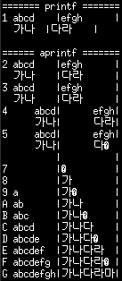

# Libprinta

Libprinta is the print-aligned C library. Functionally, it is similar to the [CJK Format](https://github.com/HuidaeCho/cjkformat) Python 3 module.

In the C language, the `strlen()` of a CJK character is not 1 because `strlen()` returns the byte length of a string and CJK characters use more than one byte per character. For example, `strlen("가")` returns 3 because Hangul syllable Ga (가) consists of `0xEA`, `0xB0`, and `0x80`. The same byte length applies to `printf()`'s string specifier (`%s`). Again, "가" in `printf("%-10s|", "가")` will consume three bytes internally and leave seven spaces resulting in


The pipe character (`|`) is at column 10, not at 11 (10 characters from `%-10s` plus `|`) as in


This misalignment issue occurs because CJK characters' byte length (3) and display length (2) are different.

The libprinta library tries to fix this problem and defines the following functions:
* `int count_wide_chars(const char *str)` counts the number of wide characters in a string,
* `int count_wide_chars_in_cols(const char *str, int ncols)` counts the number of wide characters in a string in a number of columns,
* `int count_bytes_in_cols(const char *str, int ncols)` counts the number of bytes in a string in a number of columns,
* `int printa(const char *format, ...)` adjusts the width of string specifiers to the display space instead of the number of bytes for wide characters and printf them using the adjusted display width,
* `int fprinta(FILE *stream, const char *format, ...)` is the `fprintf()` version of `printa()`,
* `int sprinta(char *str, const char *format, ...)` is the `sprintf()` version of `printa()`, and
* `int snprinta(char *str, size_t size, const char *format, ...)` is the `snprintf()` version of `printa()`.

## Installation

```bash
# build the library and test
make

# test
./test
```



## License

Copyright (C) 2020, Huidae Cho <<https://idea.isnew.info>>

This program is free software: you can redistribute it and/or modify
it under the terms of the GNU General Public License as published by
the Free Software Foundation, either version 3 of the License, or
(at your option) any later version.

This program is distributed in the hope that it will be useful,
but WITHOUT ANY WARRANTY; without even the implied warranty of
MERCHANTABILITY or FITNESS FOR A PARTICULAR PURPOSE.  See the
GNU General Public License for more details.

You should have received a copy of the GNU General Public License
along with this program.  If not, see <<http://www.gnu.org/licenses/>>.
